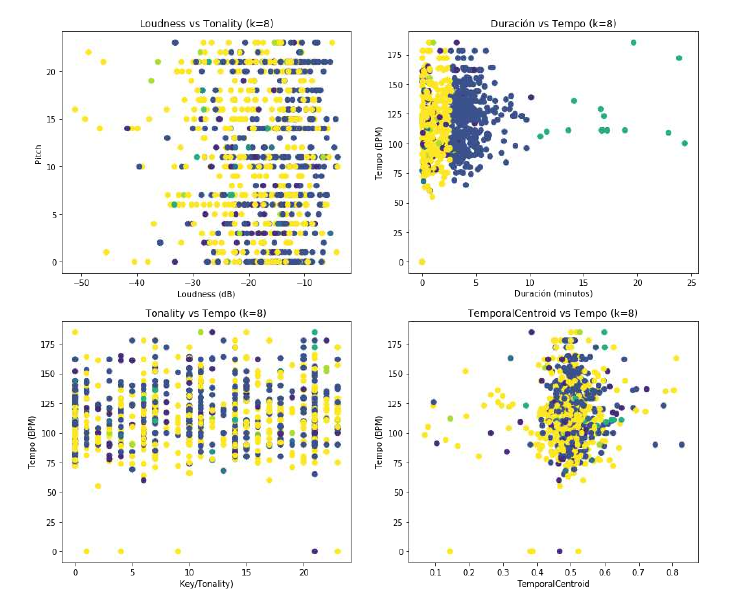

# Introducción

A partir de un dataset generado a partir de la extracción de características (features) de la base de datos de sonidos de [RedPanal](https://redpanal.org), un sitio colaborativo que almacena y reproduce a demanda sonidos compartidos con licencias del tipo [Creative Commons](https://creativecommons.org/), se busca extraer conocimiento sobre la composición de la base de datos utilizando diferentes algoritmos de Machine Learning.

Para extraer features de los archivos de sonido se utilizo el [Audio Commons Extractor](https://github.com/AudioCommons/ac-audio-extractor) que genera para cada sonido un archivo JSON con diferentes valores como: duración, tonalidad, rango dinámico, volumen, si es el sonido es "loopeable o no", si se trata de un "evento único" o no, entre otros.

Originalmente la idea era analizar aquellos cuya duración era menor a 5 segundos, ya que a priori se pensaba que de los mismos se podía extraer mejor información, ya que su contenido no varia tanto en el tiempo, pero se descartó, ya que se encontró que el dataset elegido contaba con muy pocas instancias de este tipo.

## Dependencias

Consultar [Dependencias.md](Dependencias.md)

# Vista General

Nota: Consultar los notebooks (archivos .ipynb) para más detalles. Se puede ver online y navegar en [nbviewer: 0 - Introducción y construcción del Dataset](https://nbviewer.jupyter.org/github/hordiales/redpanal-db-analysis/blob/master/0%20-%20Introducci%C3%B3n%20y%20construcci%C3%B3n%20del%20Dataset.ipynb).

# Armar Dataset

Se utilizan los archivos .py especialmente programados para esta tarea.

### Paso 1: Convertir archivos a .wav

Convertir todos los archivos de audio a un mismo formato estándar como WAV 16bits y 44.1kHz

Sintaxis: ./1_convert_all_files_to_wav.py [FILES_DIR] [WAVS_DIR]

    $ mkdir ../../wavs
    $ ./1_convert_all_files_to_wav.py ../../redpanal_audios/ ../../wavs/

### Paso 2: Calcular features/descriptores MIR

Sintaxis: ./2_files_mir_analysis.py [FILES_DIR] [JSON_DIR]

Este paso hace uso del [Audio Commons Extractor](https://github.com/AudioCommons/ac-audio-extractor) mencionado, utilizando el contenedor Docker y se configura para utilizar generar por cada archivo de audio un .json plano o con la ontología para descripción de audio propuesta por el artículo: https://www.audiocommons.org/2018/07/15/audio-commons-audio-extractor.html.

Note: se necesita $PWD o full path (por cuestiones de Docker)

    $ mkdir json
    $ ./2_files_mir_analysis.py $PWD/../../wavs/ $PWD/json/

### (opcional) Paso 3: Separa canciones de 'muestras' según duración

Este paso se aplica solo para algunos análisis y separa sonidos de menos de 5 segundos de duración en diferentes directorios.
 
Sintaxis: ./3_separate_samples_and_songs.py ./json

### Paso 4: Convertir los archivos JSON en un único archivo separado por comas (.csv)

Genera un único archivo .csv compatible con python sklearn o R según configuración.

Sintaxis: ./4_json_files_to_csv.py json-songs/

Se calcula la cantidad de líneas generadas:

    cat snd-dataset-from-plain-json.csv | wc -l
    1018

Por lo cual se observa que el dataset se compone de 1018 instancias.

----------

**Siguente:** [1 - Visualización y clustering (no supervisado)](https://nbviewer.jupyter.org/github/hordiales/redpanal-db-analysis/blob/master/1%20-%20Visualizacio%CC%81n%20y%20clustering.ipynb)
